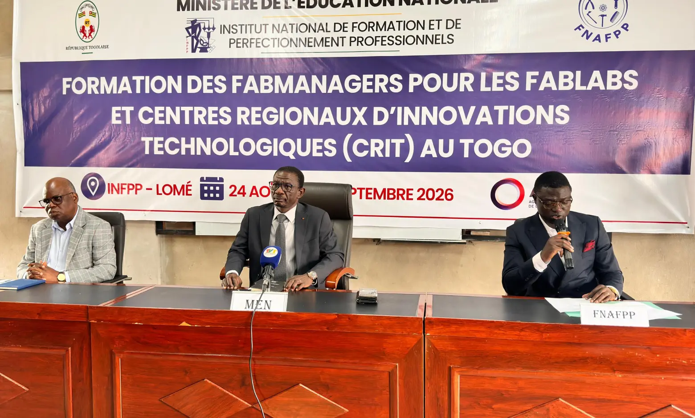

 # Journal du lundi 24 août 2026 (rédigé par : Ablavi N'BOUKE)
 
## Fait aujourd'hui
- [ ] Lancement officiel de la formatin
- [ ] Documentation
- [GitHub](https://github.com)
## Fait aujourd'hui
### CEREMONIE D'OUVERTURE
> Les activites ont commencé avec le discours de binvenue du responsable de l'INFPP puis celui du responsable du FNAPP souhaitant a tousla bienvenue et exprimant leur profonde reconnaissance au chef du conseil pour tous ses efforts pour un togo meilleur.Enfin prend la parole, le ministre de l'éducation national pour son mot de bienvenu et saisit l'occasion pour expliquer un peu ce qu'il attent des futurs FabManagers. La cérémonie de l'ouverture s'est terminée avec la prise d'une photo de famille.

---

## PREMIER MODULE DE LA FORMATIN: LA DOCUMENTATION

- Définition de la documentation
- les fonctions de la documentation
- les cinq principes 
- les outils: VScode,Git, Github Pages
- le langage Markdown
- Quelques syntaxes   
## Le compte Github
[] La création de compte Github

