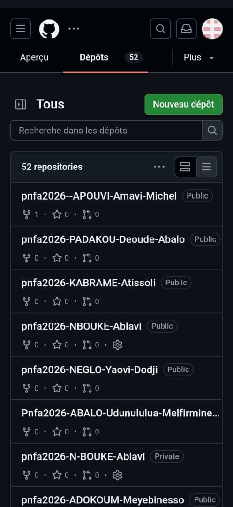
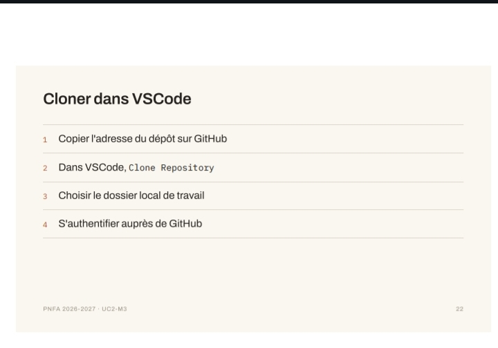

# Journal — mardi 25 août 2026 (rédigé par : Ablavi N'BOUKE)

## Fait aujourd'hui

 Installation des dépots
- [ ] Création d'un dépot
- [ ] Cloner dans VSCode
- [ ] Les cinq gestes de Git
- [ ] Le message de commit

La journalisation
- [ ] Les cinq rubriques de l'entée du journal  
- [ ] Le travail pratique
## Appris

- comment créer un dépot sur Github

- le clonage 
>Pour cloner dans VSCode, il faut copier l'adresse du dépot sur Github, le coller dans clone Repository du VSCode ensuite choisir le dosier local de travail puis s'authentifier auprès de Github 

## Raté

- [Le clonage sur VSCode] → [faute de la reception du lien d'invitation]

