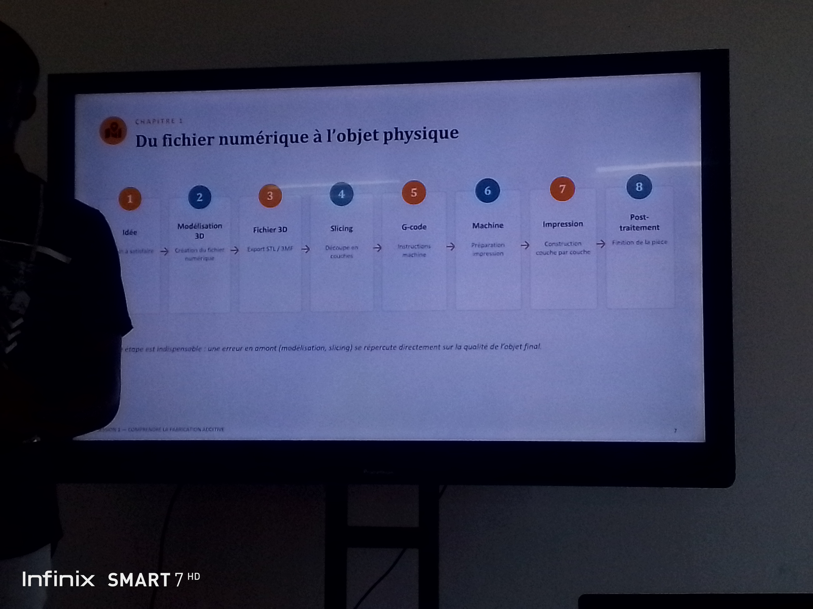

# Journal — mardi 26 août 2026 (rédigé par : Ablavi N'BOUKE)

## Fait aujourd'hui

- [ ] Fabrication Numéreique
- [ ] Projet de soutenance
## Appris

### La fabrication additive
- La definition 
- Le filament SLA et TPE
- [G-Code](https://www.machiningminghe.com): Le langage de base de la programmation CNCD
- La tempéreture ambiante est un facteur à prendre en compte pour une impression 3D
- Les trois logiques de fabrication: additive(Exple: impression 3D, FDM,SLA,SLS);Soustrative et traditionnelle
- 8 etapes à suivre pour passer du fichier numérique a l'objet physique

### Projet de soutenance
> le projet de soutenance doit etre un projet didactique qui répond à un besoin réel.

# Pause de 12h30-14h0
## Raté, puis corrigé

- [Le fait] → [hypothèse de cause] → [correction tentée] → [résultat]

## Décidé

- [Arbitrage rendu et son motif] → issue #NN fermée / BOM mise à jour

## À faire demain

- [Action] — Prénom
- [Action] — Prénom

