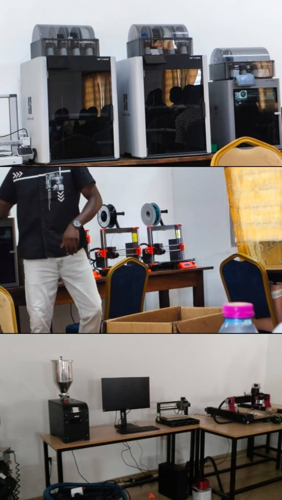
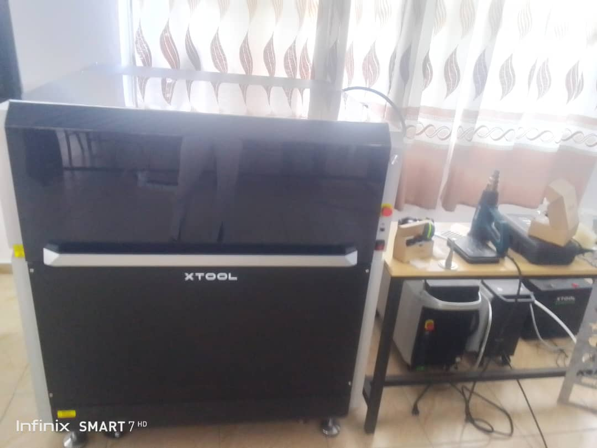
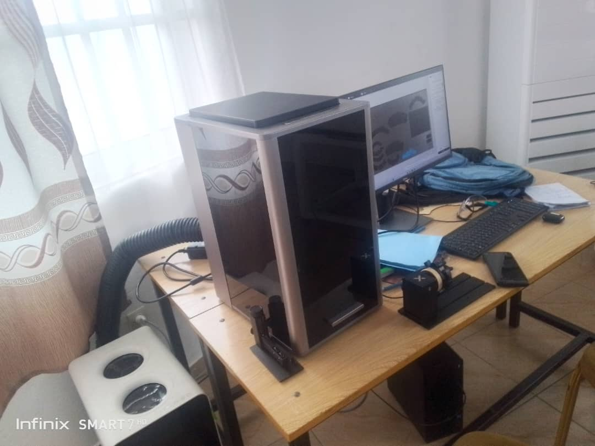
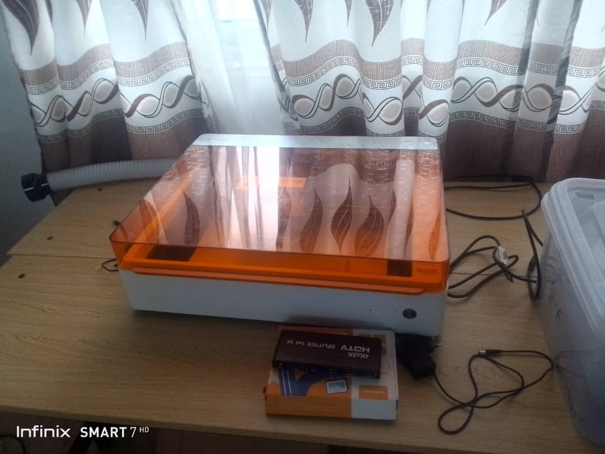
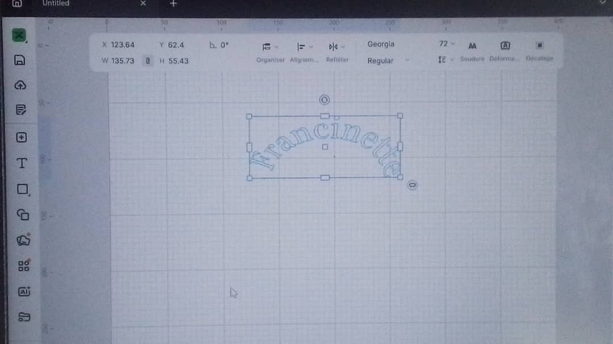
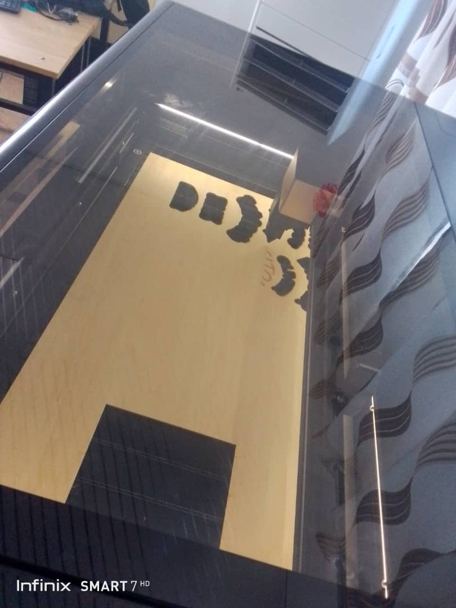
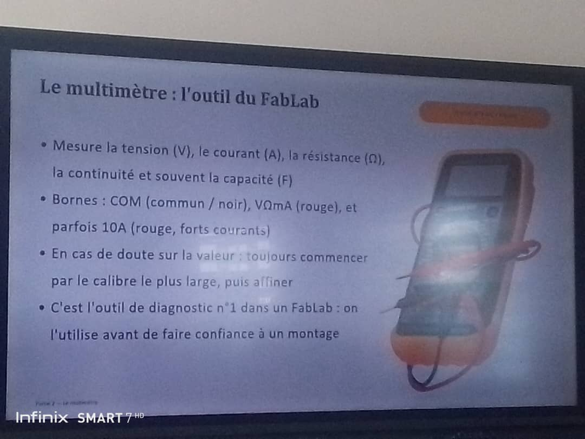
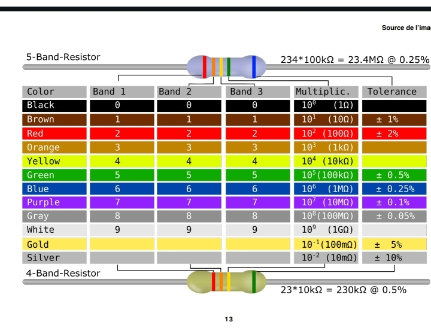
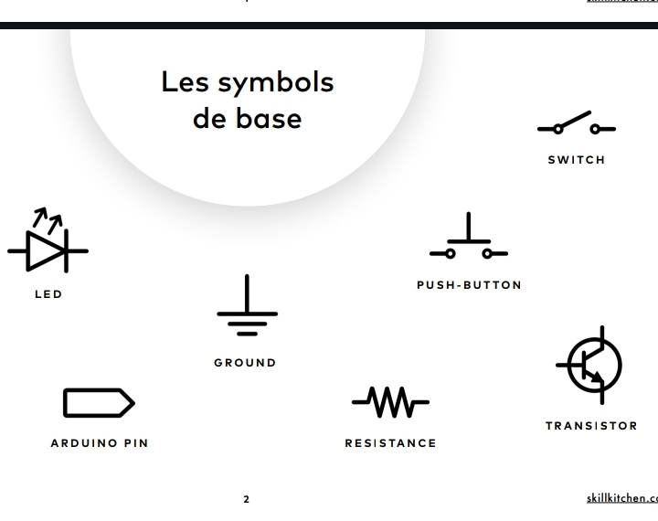

# Journal — mardi 26 août 2026 (rédigé par : Ablavi N'BOUKE)

## Fait aujourd'hui

- [ ] Fabrication Numéreique
- [ ] Projet de soutenance
- [ ] Decoupe Laser
- [ ] Les Bases de l'électronique
## Appris

### Section 1
La fabrication additive
- La definition 
- Le filament SLA et TPE
- [G-Code](https://www.machiningminghe.com): Le langage de base de la programmation CNCD
- La tempéreture ambiante est un facteur à prendre en compte pour une impression 3D
- Les trois logiques de fabrication: additive(Exple: impression 3D, FDM,SLA,SLS);Soustrative et traditionnelle
- 8 etapes à suivre pour passer du fichier numérique a l'objet physique

- les imprimantes 3D

### Section 2
 Gestion de projet 
> le projet de soutenance doit etre un projet didactique qui répond à un besoin réel.

# Pause de 12h30-14h0
### Section 3
La découpe Laser
- Définition de la decoupe Laser
- anatomie d'un Laser
- les quatre types de Laser:
---
 [ ] Metal Lab
 
---
 [ ] P3
 
---
 [ ] F2 Ultra
 
---
 [ ] M1 Ultra
 
---
 - installation de xTOOl et création de projet
 
 - Impression et découpe avec le P3
 
 ### Section 4
 Les bases de l'électronique
 - La tension 
 - Le courant
 - La résistance
 - Le multimètre

- La lecture de la résistance

- Les symboles de base

