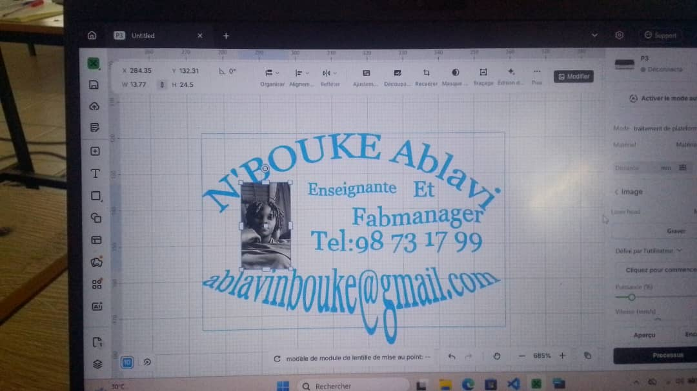
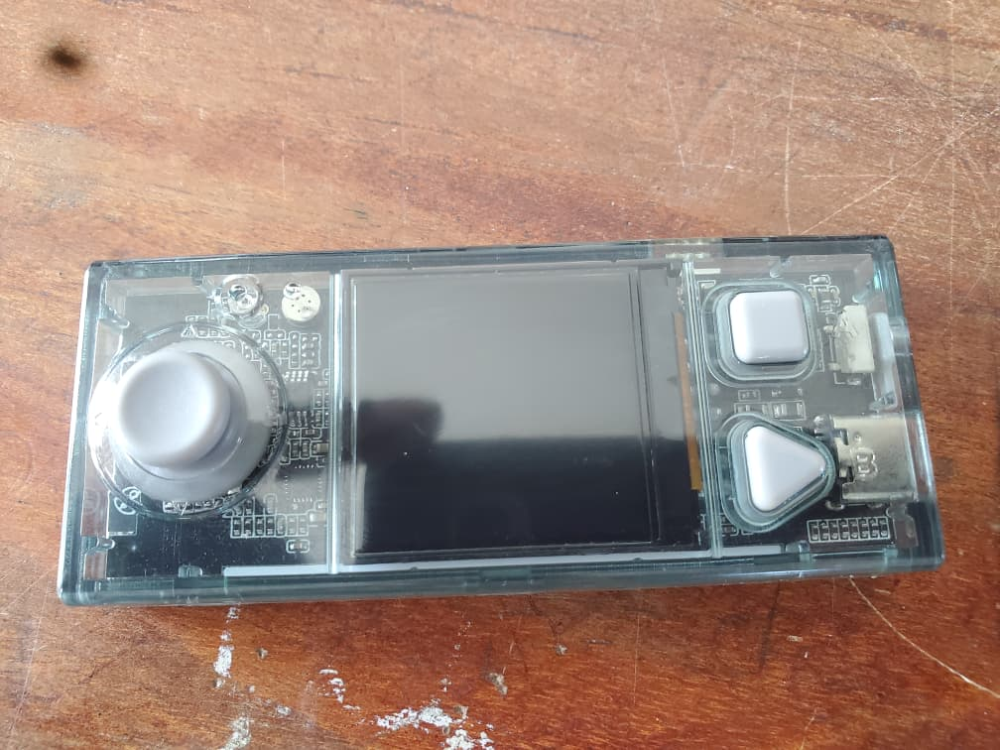
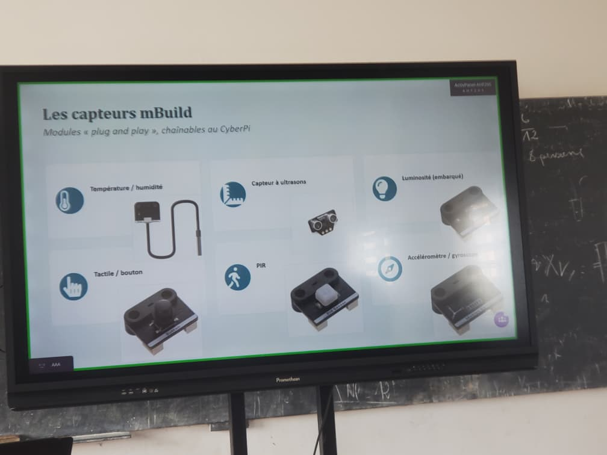
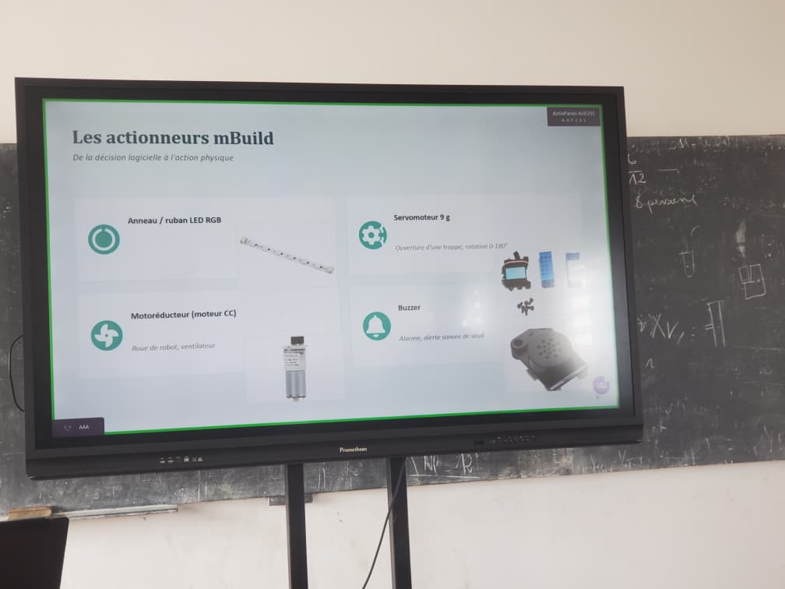
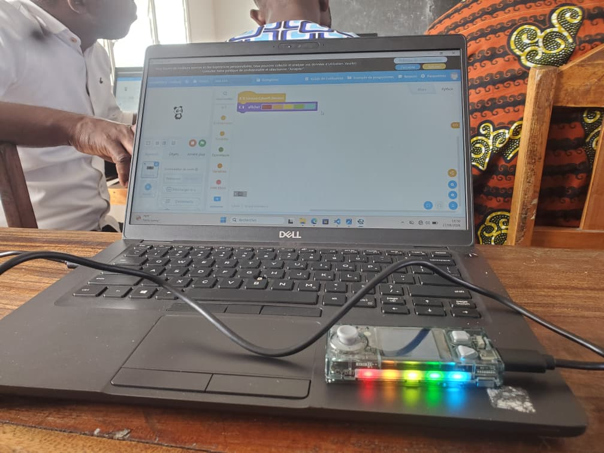

# Journal — mardi 27 août 2026 (rédigé par : Ablavi N'BOUKE)

## Fait aujourd'hui

- Exploration de xTOOl
- CyberPi et l'ésosysteme mBuild
- Exploration de mBlock
- Impression 3D
## Appris
1- création d'une carte de visite avec xTOOl
> Enrégistrer les parametres: Couper(puissance=90, vitesse=50); Graver(puissance=20, vitesse=600)
 
- la découpe de la carte de visite avec la machine P3
---
2-CyberPi et l'écosystème mBuild
> la cyberPi est une carte électronique,un cerveau qui recoit et actionne le mouvement.

---
> Difference entre un actionneur et un capteur est qu'un capteur mesure une grandeur physique de l'nevironnement et la trensforme en information numérique alors qu'un actionneur converti une information numérique en un mouvement ou en une force contrôlés
- Exemples de capteurs mBuild

- Exemples de actionneurs mBuild

---
3-Exploration de mBlock
- familiarisatin avec les differentes commandes de mBlock
- la programmation 

---
4- Du fichier numérique 3D à l'impression
- faire le choix de l'imprimante
- verifier le diamètre de la buse(0.4)
- choix du filament
- nombre de la parois(2)
- ajouter des supports s'il le faut
- ajouter de modifications si nécessaire
- trancher le plateau 
- lancer l'impression

