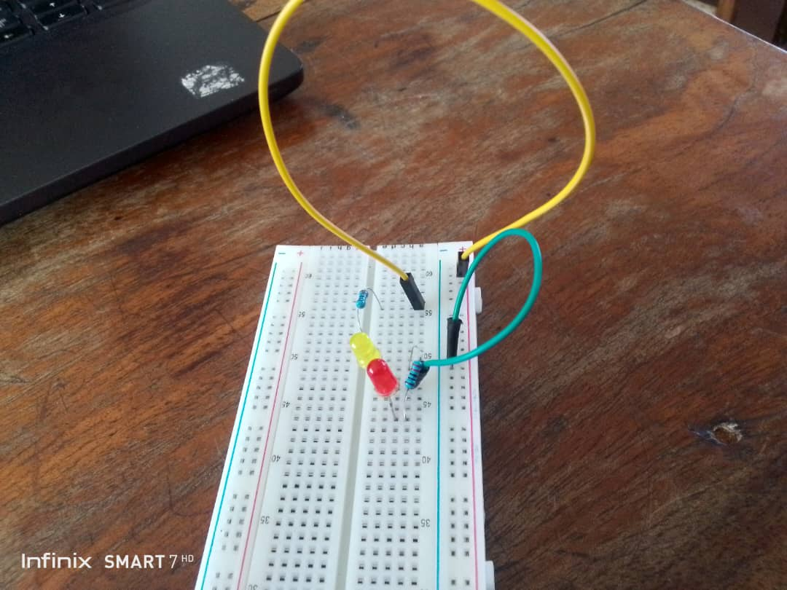
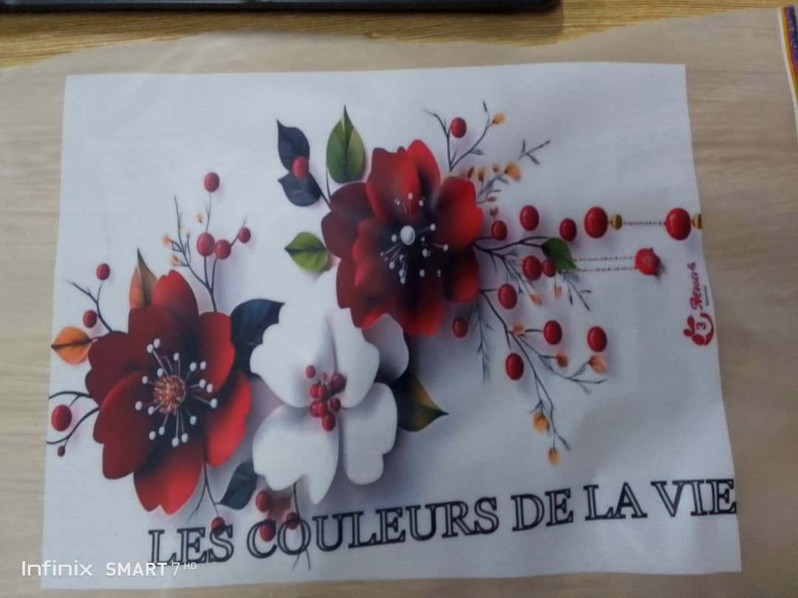

# Journal — mardi 01 septembre 2026 (rédigé par : Ablavi N'BOUKE)

## Fait aujourd'hui
- [ ] Conception avec Fusion 360
- [ ] Conception d'un porte-clés
- [ ] Maîtrise du Breadboard SK10
- [ ] Impression DTF
## Appris

- Les différentes manières de concevoir un cylindre :

   1- Partir d'un rectangle, puis faire une extrusion et enfin une révolution de 360 degrés.

   2- Partir d'un cercle et lui donner une hauteur.

   3- Choisir un cylindre.

- Conception d'un porte-clés

- Circuit électrique sur le Breadboard
> J'ai réalisé un circuit comportant un générateur, une LED et une résistance.

- Impression DTF (Direct-to-Film) :
> C'est une technique d'impression pour personnaliser des T-shirts, des casquettes et des sacs.
Les étapes de l'impression DTF sont les suivantes : concevoir, imprimer, poudrer, cuire, presser, puis retirer.
<!--  -->
## Raté, puis corrigé
 
- J'ai eu un peu de mal à finaliser l'impression DTF parce que je n'ai pas bien suivi les explications sur cette partie, mais j'y suis arrivée avec l'aide de mes collègues.

## Décidé

- J'ai décidé de m'améliorer dans le domaine de l'impression DTF.

