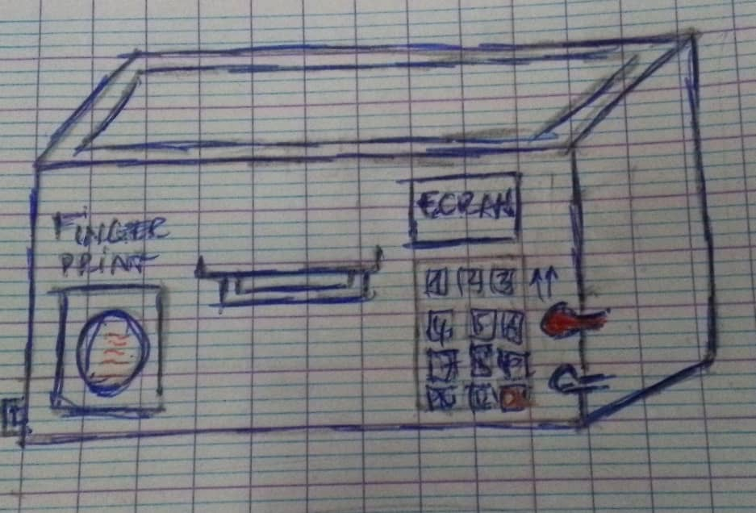
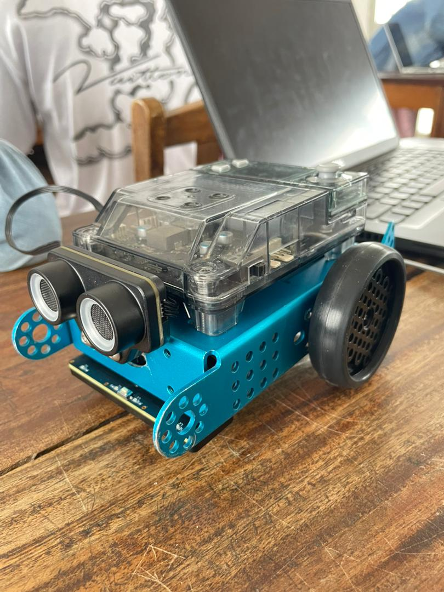
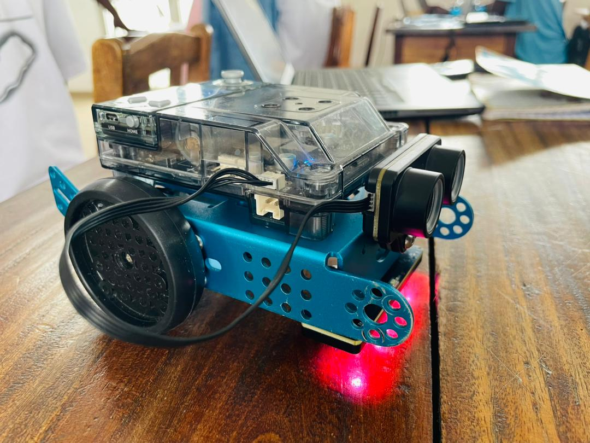

# Journal — mercredi 02 septembre 2026 (rédigé par : Ablavi N'BOUKE)

## Fait aujourd'hui

- [ ] Croquis de notre projet
- [ ] Le robot mBot2
- Fondatmentaux por les futurs Fabmanagers

## Appris
 ### Section 1
 cette section est consacrée à toutes les groupes pour faire les croquis de leur projet. une consigne que notre groupe a prise au serrieux
 voici le croquis de notre projet(coffre fort à double authentification) 

### section 2: Assemblage du mBot2
- Avec toutes les pièces de mBot2, je suis arrivée à assembler le mBot2

### section 3: Algorithmique débranchée
 - Algorithme c'est une suite ordonnée, finie, claire et non ambigue d'instructions permettant de résoudre une problématique
- les étapes qui définissent un algorithme 
a- une suite ordonnée d'instructions
b- un nombre fini d'étapes
c- Des instructions précises
- Algorithmique débranchée:
## Raté, puis corrigé

- [Le fait] → [hypothèse de cause] → [correction tentée] → [résultat]

## Décidé

- [Arbitrage rendu et son motif] → issue #NN fermée / BOM mise à jour

## À faire demain

- [Action] — Prénom
- [Action] — Prénom

