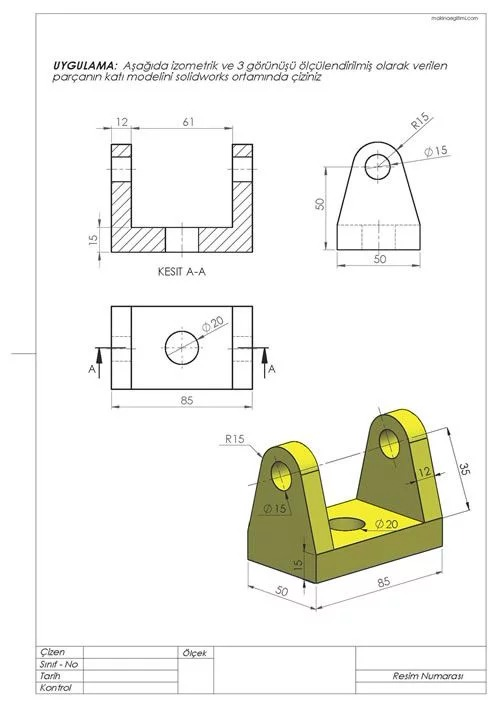
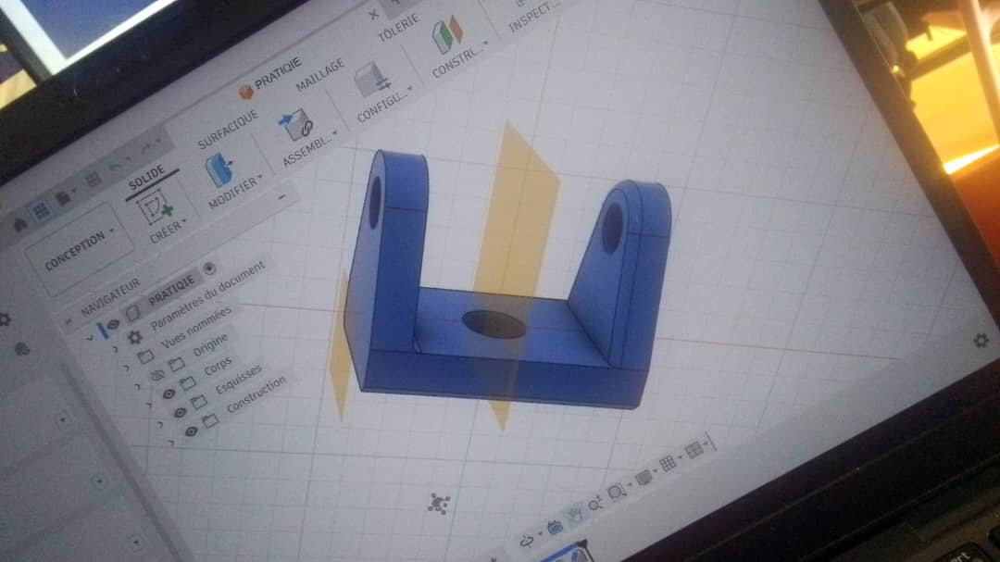

# Journal — mardi 25 août 2026 (rédigé par : Ablavi N'BOUKE)

## Fait aujourd'hui

- [ ] Fabricatin des PCB
- [ ] Modélisation avec fusion
- [ ] Le cours de python
## Appris
### section 1: cours sur le PCB
- PCB est un circuit imprimé qui permet de connecter et de maintenir électriquement des composants électroniques sur une carte.
- Pourquoi utiliser le PCB?
>On utilise le PCB pour: relier les composants etectroniques,remplacer les cablages realisés manuellement, rendre le circuit plus compact,faciliter la reproduction, améliorer l'esthétique,rendre les circuit plus professionnel
- les méthodes de fabrication ( Perchlorure de fer, papier glacée plus fer à repasser; fabrication numérique)
- pourquoi utiliser le xTool F2Ultra? 

a- gravure et traitement  précis

b- travail automatisé

c- répétabilité

e- rapidité d'execution

f- adaptation au prototype rapide

### Modélisation 
Le defis de cette section est de modeliser la piece sur de la photo ci-desous.

pour cette piece, les étapes sont:
- rectangle centré( dimensionner)
- cercle centré
- extrusion
- deuxieme et troisieme cercle centrés à une distance de l'un des petits coté du rectangle
- deux lignes reliant les deux bords de la largeur au troisieme cercle et utilisation de la contrainte tangente entre le cercle et la ligne
 - extrusion
 - construction (decalage de plan)
 - symétrie miroir 
 voici ce que j'ai produit
 
 ### section 3: cours sur python
 - Structures de controle
    a- les opérateurs(Arithmétiques,Comparaison,Affectation,Logiques)
    b- Les	conditions	:	if	/	elif	/	else
 -  Les boucles

    a- la boucle for

    b- La boucle while
  - Structures	de	données

  a- la liste( modifiable)
  
  b- Tuples (non modifiable) 	et	dictionnaires

