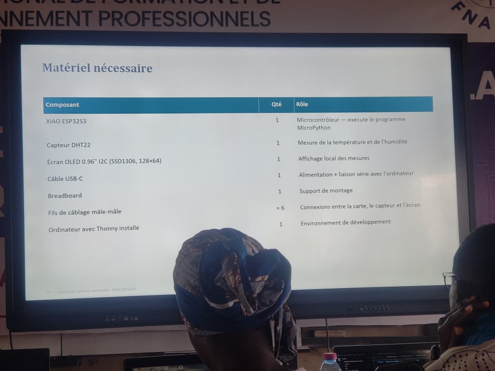
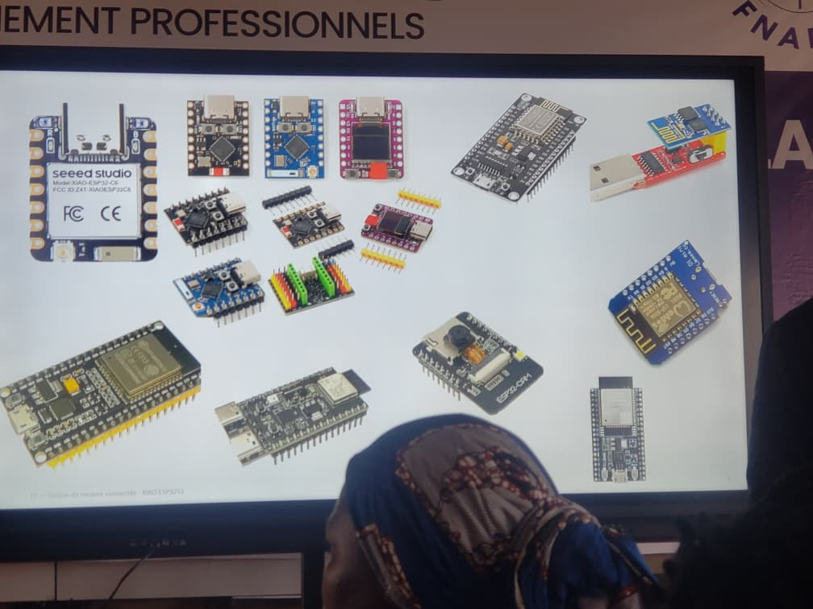
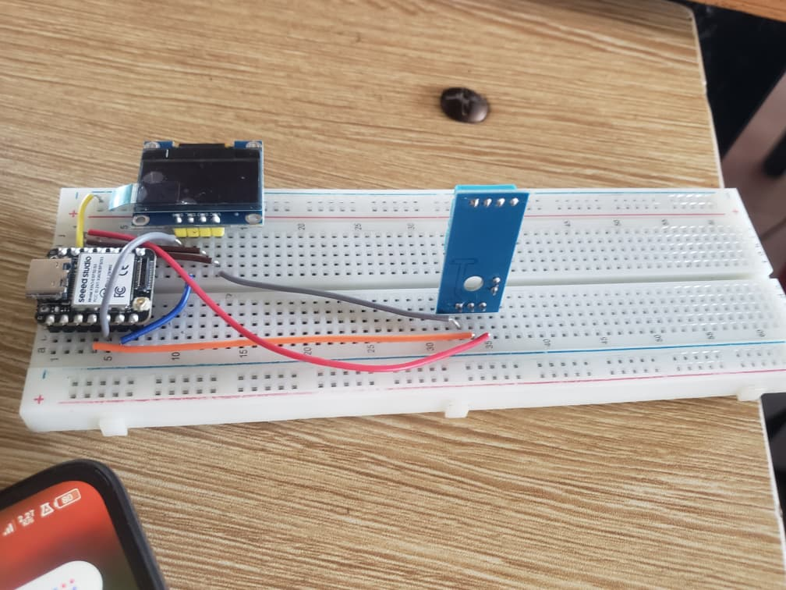
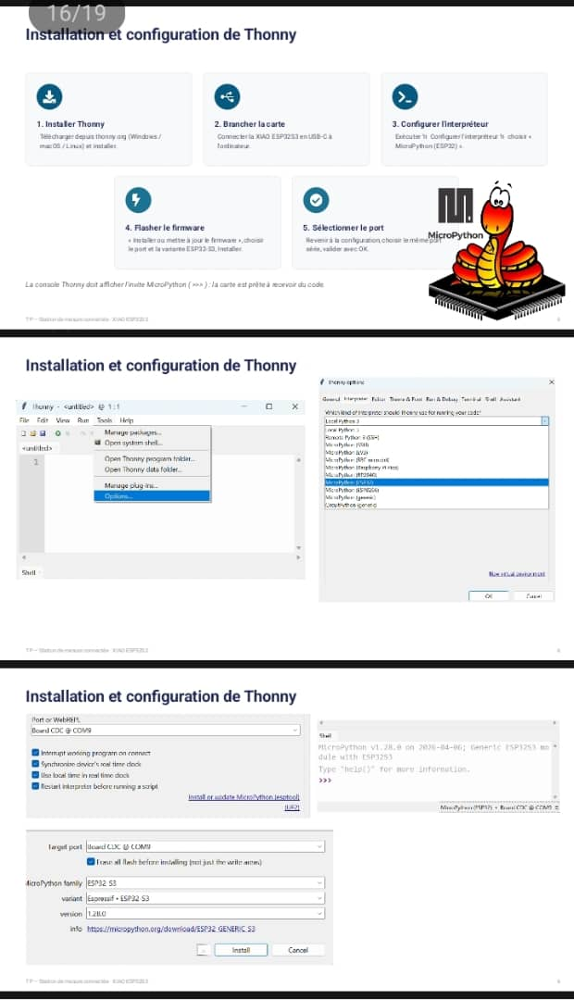
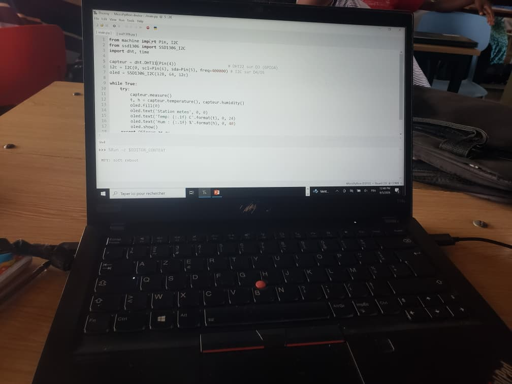
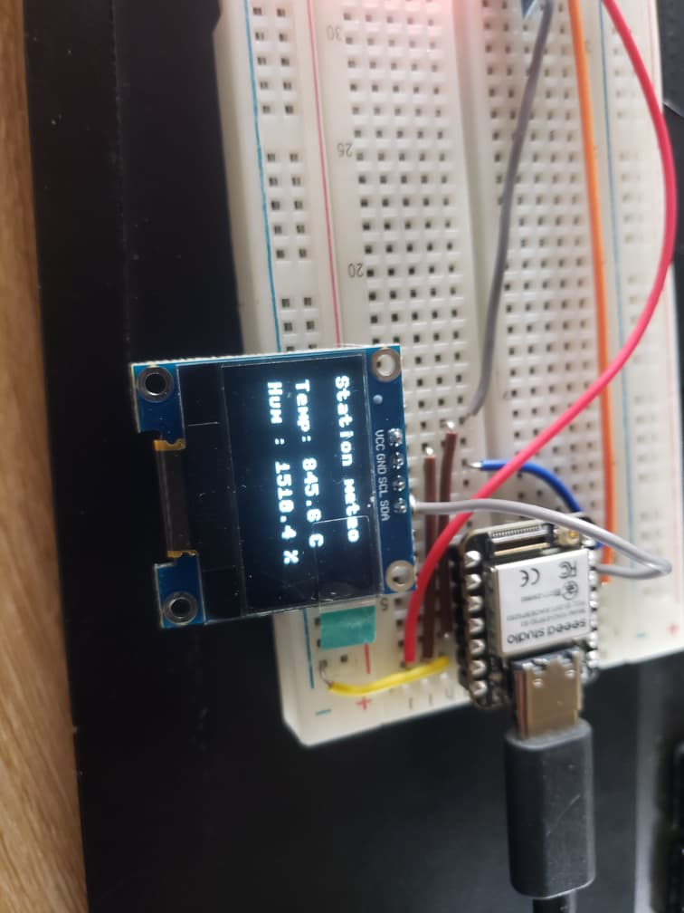

# Journal du  samedi 05 Septembrre 2026 rédigé par : Ablavi N'BOUKE

## Fait aujourd'hui

- [ ]  Smart Weather Station  

## Appris
### Smart Weather Station = Station météo connectée
>C’est une station météo qui prend les données chez toi et les affiche sur un ecran
- Les matériels
Pour ce projet, nous avons besoin des matériels suivants:

a- capteur de température (DTH22 Sensor)

b- Ecran OLED( I2C OLED)

c- XIAO ESP32S3

d- Breadboard 

e- Les fils de connexon

f- un ordinateur avec Thonny installé

- les variantes de ESP32S3
 
- Schéma de cablage 

### Installation et configuration de thonny pour programmer une carte ESP32 en MicroPython

- le programme de la station dans Thonny
 

## Raté, puis corrigé
### Le fait
- On n'a pas les valeurs réelles de température et d'humidité  
### Hypothèse
L'hypothèse est que nous n'avons pas utilisé le bon capteur de température dans le code
### Solution
 On a changé le DTH22 par le DTH11 dans le code
### Résultat
les bonnes valeurs sont affichées sur l'écran
 
## Décidé
>J'ai decidé de toujours verifier les caracteristiques des composants avant de passer au programme

