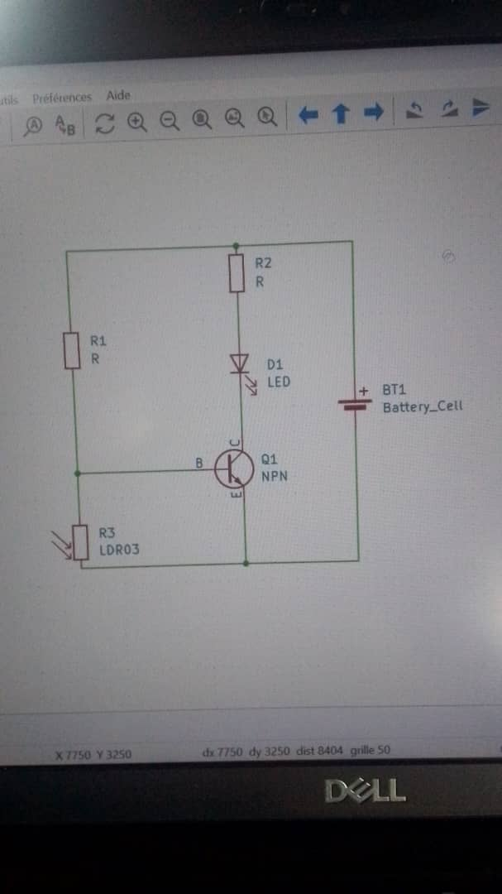
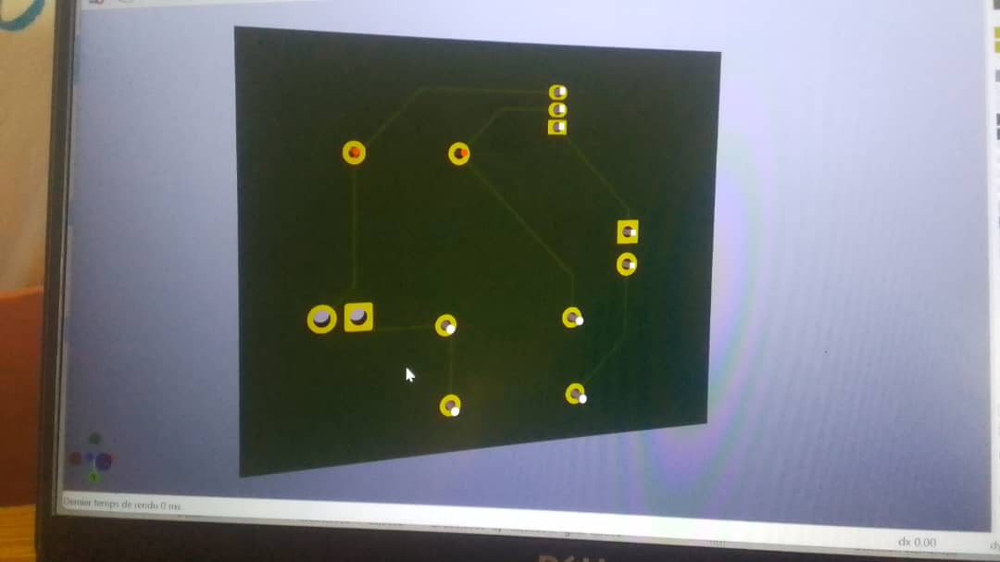

# Journal du lundi 07 septembre 2026 rédigé par : Ablavi N'BOUKE

## Fait aujourd'hui

- [ ] Cours d'initiation aux PCB
- [Kicad](https://www.bing.com)
## Appris
### A- Initiation aux PCB
>PCB (Printed Circuit Board) est un circuit imprimé qui sert à supporter,connecter et organiser les composants electroniques. Les connexions électriques sont r"alisées grace aux pistes.
La différence entre PCB et le Bradboard est que le Breadboard permet d'expériùenter alors que le PCB transforme l'expérience en une carte électronique réelle.
- pourquoi passer du prototypage au PCB?

| Breadboard |    PCB |
|:---        | :---   | 
| Cablage volumineux et fragile       |     Reduction taille et cable| 
|Cunnxion moin fiables       | Connexion solide et répétables| 
|Sensible au vibration       | Meilleure résistance | 
|Difficile à dupliquer        | Facile à dupliquer   | 
---  
- anatomie du PCB

a- Substrat

b- Cuivre

c- Solder Mask

d- SilksCreen

e- Pads

- De l'idée au schéma
1- definir clairement ce que le circuit doit faire

2- Choisir les composants adaptés

3- Réaliser le schéma électronique avant de déssiner la carte

4- Associer chaque composant à son footprint

5- Définir les contraintes

###  Kicad
- Exploration de Kicad
- fabrication du PCB d'un circuit contenant : un transistor, deux résistances, une Led, une photorésistance et une batterie

## Raté, puis corrigé
Tout s'est bien passé aujourd'hui

## Décidé

continuer sur cette meme lancée

## À faire demain

Travailler sur notre projet de groupe

