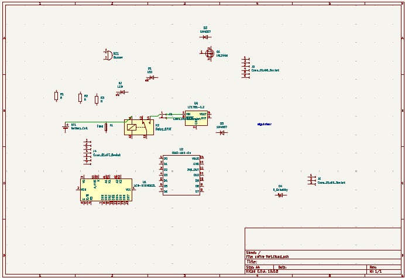
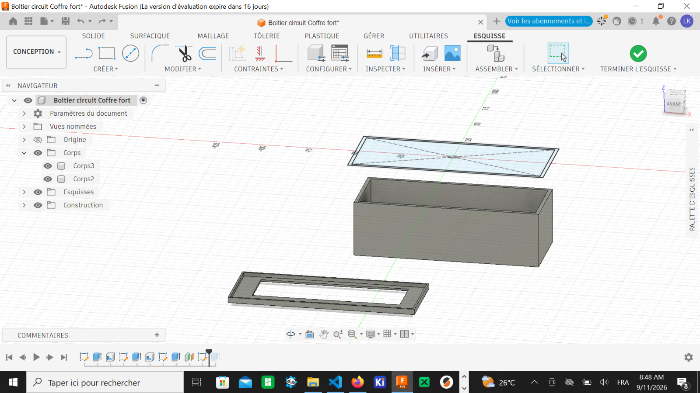
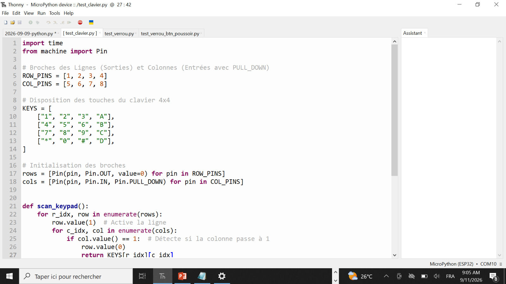

# Journal — Jeudi 10 Septembre 2026 rédigé par Ablavi N'BOUKE

---
## Fait aujourd'hui

* **Travail en équipe & Conception du projet Coffre-fort Intelligent** :
* **Conception PCB sous KiCad** : recherche des références exactes et empreintes des composants requis pour le circuit imprimé.

* **Gestion des bibliothèques** : importation des symboles et empreintes absents de la bibliothèque standard KiCad.
* **Conception mécanique CAO** : lancement de la modélisation 3D du boîtier sur mesure pour intégrer le PCB et le mécanisme.

* **Inventaire matériel** : réception et vérification de la liste des composants matériels pour le prototype.

* **Banc d'essai & Tests des composants matériels** :
* **Configuration de l'environnement** : connexion du microcontrôleur **XIAO ESP32-S3** en USB-C, flashage du firmware MicroPython et paramétrage du port série dans l'IDE Thonny.
* **Test 1 — Clavier matriciel $4 \times 4$** :
* Déploiement d'un script MicroPython de balayage lignes/colonnes.

* Premier clavier : échec du test (seule la touche `*` répondait). Remplacement immédiat.
* Second clavier : test concluant à 70% — validation du bon fonctionnement des touches numériques `1`, `2`, `4`, `5`, `7`, `8`, `*`, `0`(sont actives)

* **Test 2 — Actionneurs & Commande de puissance** :
* Mise en place d'une **source d'alimentation externe** dédiée pour fournir la puissance nécessaire au circuit du solénoïde et du bouton-poussoir.
* Validation du déclenchement du solénoïde via le module relais piloté par les sorties numériques du XIAO ESP32.

* Bilan de l'étage de puissance : 100% fonctionnel.

--- 
## Appris
* **Diagnostic matériel systématique** : tester individuellement chaque composant (*Hardware-in-the-loop*) sur Thonny évite d'intégrer du matériel défaillant sur le PCB final.
* **Alimentation séparée de la puissance** : les microcontrôleurs (3.3V) ne peuvent pas fournir directement l'intensité requise par un solénoïde ; l'utilisation d'une alimentation externe couplée à un relais est indispensable pour préserver la carte et garantir le verrouillage.

---
## Raté, puis corrigé

**Erreur :** Seule la touche `*` du premier clavier matriciel $4 \times 4$ émettait un signal dans le terminal Thonny.

**Hypothèse :** Matériel vétuste ou oxydation interne des pistes (le clavier utilisé n'était pas neuf et présentait des signes d'usure).

**Correction :** Remplacement par un second clavier matriciel $4 \times 4$ et réexécution du script de test.

**Résultat :** Réception correcte des touches des deux premières colonnes.Validation de l'algorithme de saisie du code PIN à 70%.
---

## Décidé
* Ne fixer sur le PCB que les composants préalablement validés sur banc d'essai.
* Isoler le circuit de commande logique (XIAO ESP32) de la ligne de puissance du solénoïde grâce à l'alimentation externe dédiée.

---
## À faire demain

* [ ] Poursuivre et finaliser la modélisation 3D du boîtier de protection du PCB — *Lucas*
* [ ] Rédiger le programme MicroPython d'analyse du code PIN et d'activation automatisée du solénoïde — 
* [ ] Réaliser le test d'ouverture/fermeture en conditions réelles et finaliser l'ensemble des bancs d'essai 