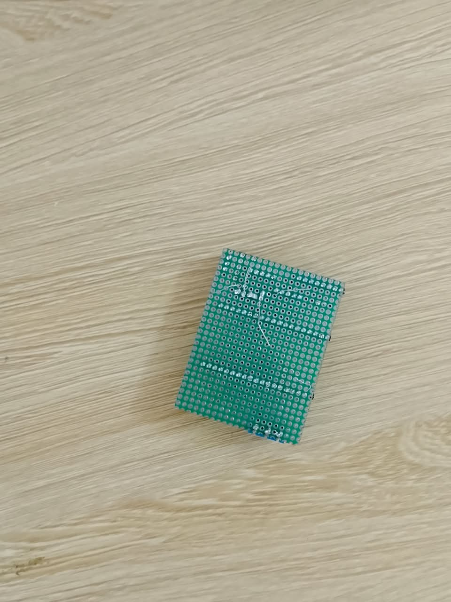

# Journal du lundi 14 septembre 2026 rédigé par Ablavi N'BOUKE

## Fait aujourd'hui

* Câblage et validation du **détecteur d’empreinte digitale**.
* Branchement et test du **buzzer**.
* Branchement du **clavier** et des **LED**.
* Branchement et test du **solénoïde**.
* Branchement et test de l’**écran LCD**.
* Reprogrammation du **buzzer** et du système de détection d’empreinte digitale.
* Soudure
* Modélisation du boitier du circuit

## Appris

* La **programmation en MicroPython**.
* Comment découper des planches avec 
* Comment faire le **câblage des composants avec l’ESP32-WROOM**.
* Comment tester les différents composants avant de faire l’intégration globale.
* Soudure:
Apres avoir finier de tester les composants et confirmer que le circuit fonctionne normalement, nous sommes passé à la soudure.
Cette etape consiste à reporter exatement le cablage fait sur la Breadbord K10 sur une plaquette perforée vu qu'on ne va pas utiliser un PCB 

## Raté, puis corrigé

* Lors de l’intégration globale du système, la **lecture de l’empreinte digitale**, le **buzzer** et l’**écran LCD** ne fonctionnaient pas correctement.

### Hypothèse

* Les problèmes pouvaient être causés par une **mauvaise connexion des câbles**, une erreur dans le **programme** ou une mauvaise configuration des composants.

### Correction

* Nous avons vérifié le câblage de chaque composant.
* Nous avons vérifié le programme en MicroPython.
* Nous avons corrigé les erreurs du programme et repris certaines connexions.

### Résultat

* Après les corrections, les composants ont commencé à fonctionner correctement.
* Le système a pu être testé à nouveau et l’intégration a été améliorée.

## Décidé

* Vérifier chaque composant avant l’intégration complète.
* Faire attention aux mesures et au câblage.
* Tester régulièrement le programme pour trouver rapidement les erreurs.

## À faire demain

* Continuer les tests du **coffre-fort**.
* Vérifier le fonctionnement de tous les composants ensemble.
* Corriger les éventuelles erreurs restantes.
* Améliorer le programme en **MicroPython**.
* Imprimer le boîtier du circuit
* Finaliser la soudure
