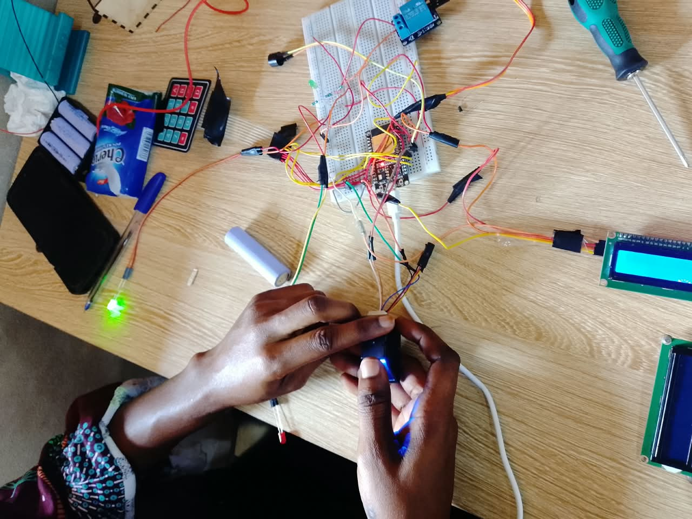

# Journal mardi 15 septembre 2026 rédigé par : Ablavi N'BOUKE

## Fait aujourd'hui

- [ ] Impression du boitier 
 >IL boitier imprimé avait quleques problemes
- [ ] Finalisation de la soudure
>On a fini avec la soudure et on a refait le cablablage sur notre  plaquette perforée
- 1er test de notre circuit 
 >Le premier test revèle que la première et la dernière colonne du  clavier ne repondent pas
- 2eme test:
>Au cours du deuxieme test plus rien ne fonctionnait. En effet lorqu'on a connecté le ESP32 à l'ordinateur pour la suite de la verification de notre circuit, on a remarqué une petite fumée venant de ce dernier et apres  plus rien ne fonctionnait.
On a immédiatement verifié si le ESP32 fonctionnait toujours mais hélas non; on a donc procedé à un changement du ESP. Malheureusement on n'a pas trouver le meme ESP au'on utilisait.

Le nouveau microcontrôleur le ESP32 DevKit V1 disponible ne possède cependant pas le même nombre de broches que celui utilisé initialement. En effet, l’ancien ESP32 disposait de 38 broches, tandis que le nouveau modèle en possède 30.
Cette différence de configuration a eu une conséquence importante sur le projet. 

-  Reprise du circuit et du câblage des composants
les connexions qui avaient été réalisées sur le premier circuit ne pouvaient pas être reprises exactement à l’identique. Nous avons donc dû réexaminer le schéma de câblage, identifier les nouvelles broches disponibles et reprendre une partie du circuit électronique afin d'adapter le système au nouveau microcontrôleur. 
Comme d'habitude, nous avons repris les cablages composant par composant 

- Test global du système

Après les différents tests individuels, nous avons essayé de procéder à une intégration globale des composants.

Cependant, le test de l’ensemble des composants n’a pas encore donné un résultat totalement concluant.

Certains composants fonctionnent correctement lorsqu’ils sont testés individuellement, mais leur fonctionnement simultané pose encore certaines difficultés.

Cette situation nous a permis de comprendre qu’un composant peut fonctionner correctement seul tout en rencontrant des problèmes lorsqu’il est intégré à un système comprenant plusieurs autres modules.

La prochaine étape consistera donc à reprendre progressivement l’intégration en contrôlant chaque interaction entre les différents composants.

## Appris
- pour tester les composants, nous avons eu besoin des codes micropython. Cette journée m'a permis de savoir comment chercher des codes des comptes GITHUP
- J'ai  apris qui'il est tres important de tester chaque composant avant de passer  l'assembalge de tous les composants
- J'ai aussi compris les conséquenses d'un court-circuit 

## Raté, puis corrigé
### le fait
-le capotage de notre circuit 
### hypothèse
 L'hypothèse de ce capotage est que les pattes des résistances se sont touchées parce que je ne l'avait pas couper au moment de la soudure ce qui aurrait causer un court-circuit
 [Le fait] → [hypothèse de cause] → [correction tentée] → [résultat]

## Décidé

- Reprendre la soudure de notre nouvevau circuit sans endommager les composant

## À faire demain

- Soudure
- Modelisation de notre boitier

